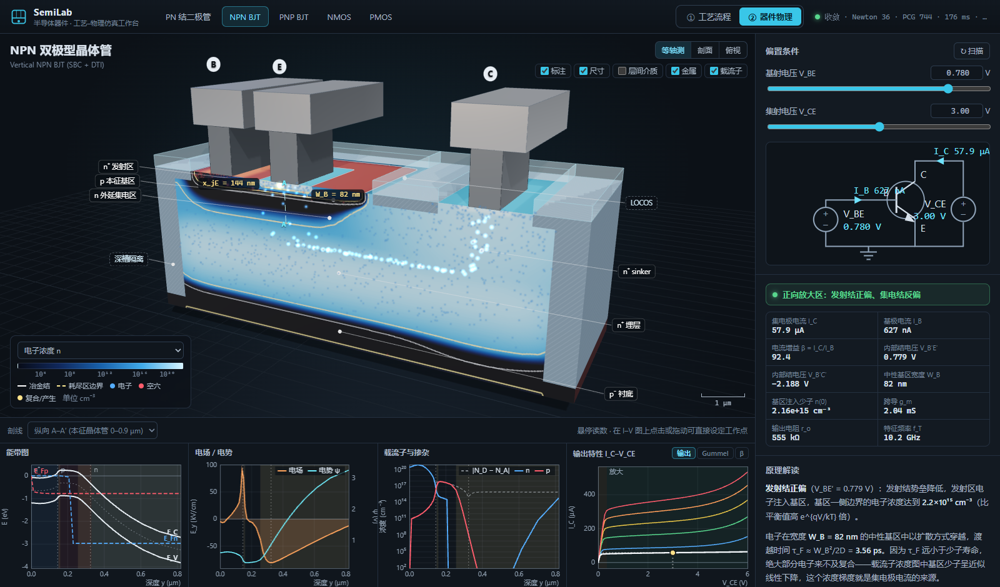
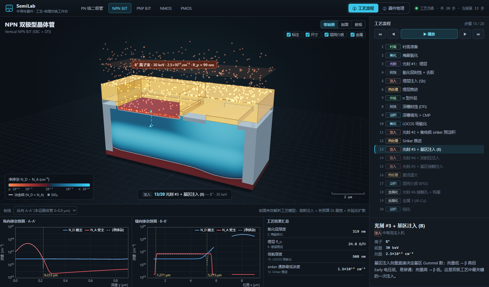
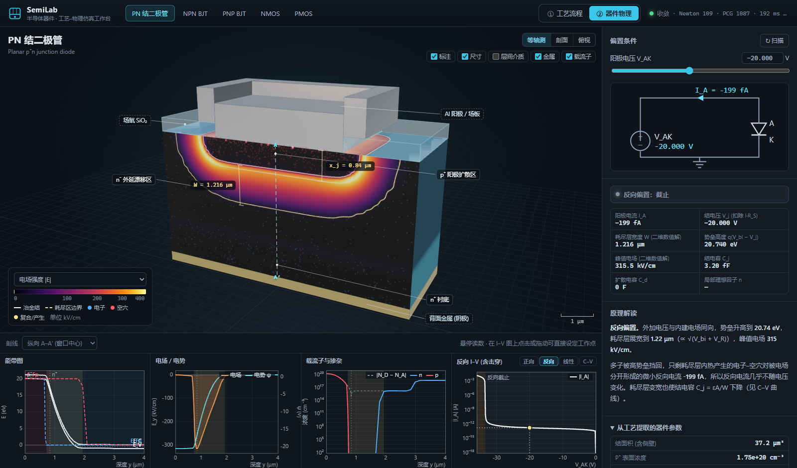
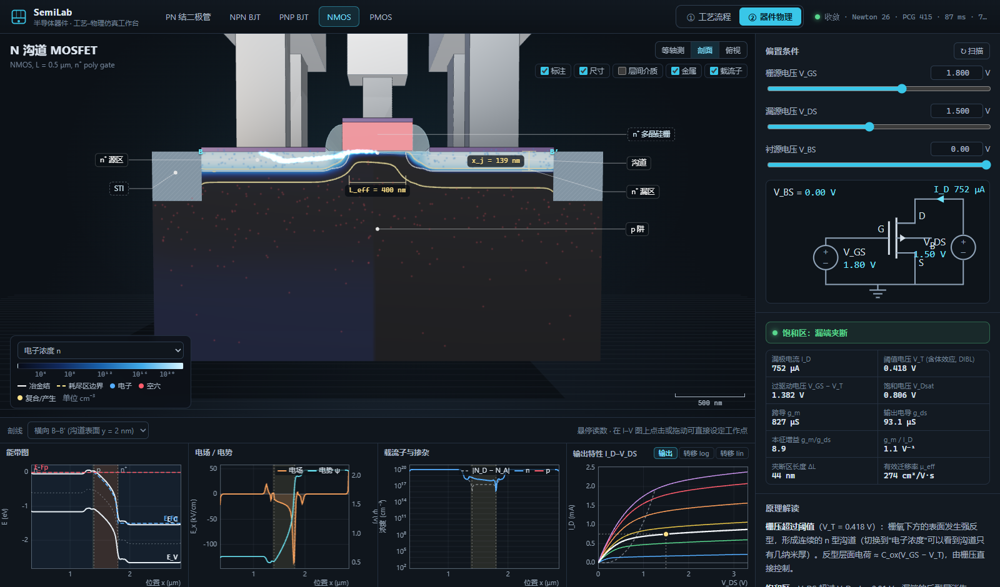

# SemiLab · 半导体器件工艺–物理仿真工作台 (v1.1)

从**工艺流程**到**器件物理**的交互式仿真：PN 结二极管、NPN/PNP 双极晶体管、NMOS/PMOS。
每个器件先按真实工艺配方"制造"出来，再在制造出的结构上数值求解二维泊松方程，
能带图、电场、载流子分布和 I–V 特性都来自计算，而不是手绘动画。



## 两种模式

### ① 工艺流程

逐步执行工艺配方（13~20 步），三维剖面随每一步生长、刻蚀、注入、退火而变化：

- **离子注入**：LSS 射程表给出 R_p / ΔR_p，高斯分布 + 掩模窗口边缘 erf 侧向分布；动画中离子被光刻胶挡住或射入硅中
- **热处理**：每一步累计 D(T)·t（B、P、As、Sb 的 Arrhenius 扩散系数），分布按 σ² = ΔR_p² + 2Dt 展宽；退火时剖面上可以看到杂质逐帧扩散
- **外延**：衬底/外延背景掺杂互扩散；被外延掩埋的埋层按"反射高斯 ⊗ 扩散核"的解析解上扩
- **氧化**：湿氧用 Deal–Grove 模型，干氧（栅氧）加 Massoud 薄氧修正
- **光刻**：掩模版与紫外曝光；LOCOS、深槽隔离 (DTI)、浅槽隔离 (STI)、侧墙、硅化物、钨塞、金属互连

每步给出设备、工艺参数、物理解释，以及仿真得到的**结深、方块电阻、氧化层厚度、有效沟道长度**等结果。



### ② 器件物理

在工艺生成的结构上求解（Web Worker 中运行，不阻塞界面）：

1. **二维非线性泊松方程**：非均匀张量网格（按结位置自动加密）上的有限体积离散，阻尼 Newton 迭代，每步用 IC(0) 预条件共轭梯度求解；非精确 Newton + 拉普拉斯位移预估初值，偏置改变时通常 20~150 ms 收敛
2. **准费米能级**：多子取所在掺杂区接触的电势；空间电荷区内两条准费米能级保持平直；MOSFET 沟道中取缓变沟道（EKV）解，漏端夹断区用准二维 sinh 模型
3. **少子连续性方程**：每个准中性区按 Kroemer/Slotboom 形式 ∇·(D nᵢ²/N ∇w) − (nᵢ²/N)(w−1)/τ = 0 求解（含 SRH + Auger 复合），结果反馈给泊松方程——BJT 基区少子的线性分布、n⁺ 衬底高–低结的"反射"都由此得到

剖面可切换显示净掺杂、静电势、电场、电子/空穴浓度、空间电荷，并叠加冶金结与耗尽区边界；载流子动画沿电流路径运动，复合/产生处闪光。
下方四个图沿选定剖线给出**能带图 (E_C, E_V, E_i, E_Fn, E_Fp)**、电场/电势、载流子与掺杂分布，以及 I–V 特性（点击或拖动曲线可直接设定工作点）。



### 紧凑模型（参数全部从工艺结果提取）

| 器件 | 模型 | 从工艺提取的参数 |
|---|---|---|
| 二极管 | Shockley 扩散电流 + SRH 复合电流 (n≈2) + 大注入 + 串联电阻 + 雪崩倍增 | Gummel 数（含禁带变窄）、n/n⁺ 高–低结、缓变结 V_bi、曲率修正的击穿电压 |
| BJT | Moll–Ross / Gummel–Poon 电荷控制模型 | 基区/发射区 Gummel 数、基区宽度调制 (Early 效应)、τ_F、Kirk 效应、r_B/r_C/r_E、BV_CBO |
| MOSFET | EKV（弱反型到强反型连续）| t_ox、沟道有效掺杂、V_FB、V_T0、体效应 γ、L_eff、迁移率退化、速度饱和、准二维沟长调制 |

右侧面板给出工作区判断、测试电路、小信号参数（g_m、r_o、f_T、g_m/g_ds…），以及**引用当前数值**的原理解读。



## 快速开始

```bash
npm install
npm run dev        # http://127.0.0.1:5173
npm run build      # 类型检查 + 生产构建
npm run verify     # 物理回归校验：工艺结果、泊松收敛、紧凑模型取值范围
npm run smoke      # 端到端冒烟测试（需先 npm run dev；使用 Playwright）
```

URL 形如 `#npn/physics`、`#diode/process`，可直接分享到某个器件和模式。

## 项目结构

```
src/
├── devices/          器件定义：几何、工艺配方（每一步的参数/解释/执行）、接触、剖线、偏置
├── physics/
│   ├── constants.ts  物理常数与硅材料模型（迁移率、寿命、禁带变窄、击穿）
│   ├── process.ts    解析工艺仿真器（注入、扩散、外延、氧化、材料）
│   ├── structure.ts  二维网格与结构（材料、掺杂、接触、掺杂连通区）
│   ├── linalg.ts     五点对称稀疏矩阵 + IC(0)-PCG
│   ├── poisson2d.ts  非线性泊松 + 少子连续性求解器
│   ├── junction1d.ts 任意剖面的耗尽近似、Gummel 数
│   ├── compact.ts    二极管 / BJT / MOSFET 紧凑模型
│   └── cutline.ts    沿剖线提取能带与分布
├── worker/           Web Worker（工艺掺杂图 + 器件求解）与通信协议
├── render/           Three.js 场景、剖面着色、工艺特效、载流子动画
└── ui/               绘图库、原理解读、测试电路图
scripts/              verify-physics / smoke / 截图与各类检查脚本
```

## 模型边界

这是面向教学与直观理解的工程级近似，而不是签核级 TCAD：泊松方程是二维数值解，但电流连续性只在准中性区对少子求解（空间电荷区内准费米能级取平直近似）；I–V 由紧凑模型给出；工艺模型不含浓度相关扩散、瞬态增强扩散和氧化消耗硅引起的界面移动。

## 许可

MIT License
